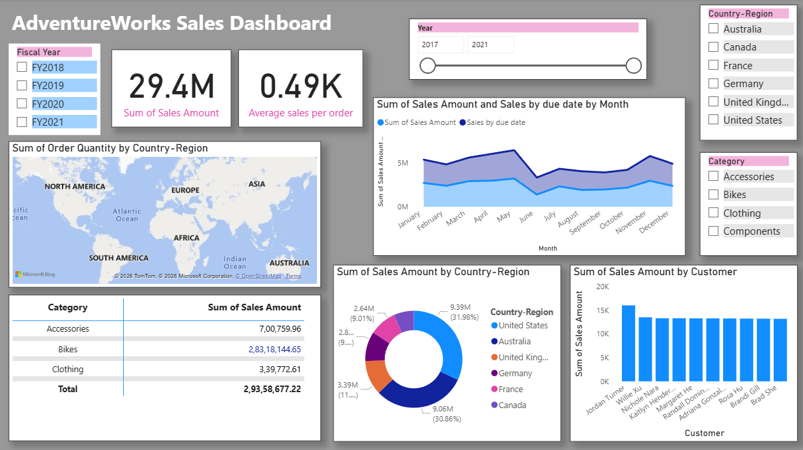
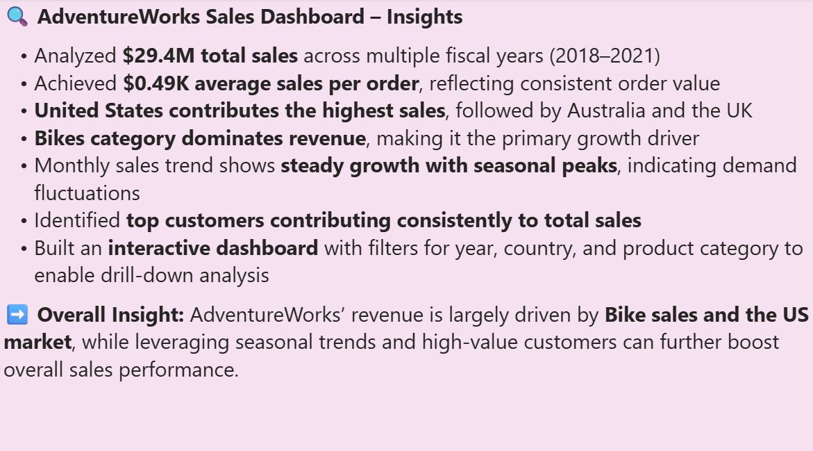

# AdventureWorks Sales Dashboard

## Project Overview
This Power BI dashboard analyzes AdventureWorks sales performance across fiscal years, countries, customers, and product categories.

## Tools Used
- Power BI
- DAX

## Key KPIs
- Total Sales: 29.4M
- Average Sales per Order: 0.49K

## Features
- Sales Trend Analysis
- Country-wise Sales Distribution
- Customer Performance Analysis
- Product Category Insights
- Interactive Filters & Slicers
- Fiscal Year Comparison

## Key Insights
- United States contributes the highest sales.
- Bikes category dominates total revenue.
- Monthly sales show steady growth with seasonal peaks.
- Top customers contribute consistently to revenue.

## Files Included
- Power BI Dashboard (.pbix)
- Dashboard Screenshots
- Insights Summary

---

# Dashboard Preview

---

# Dashboard Insights

