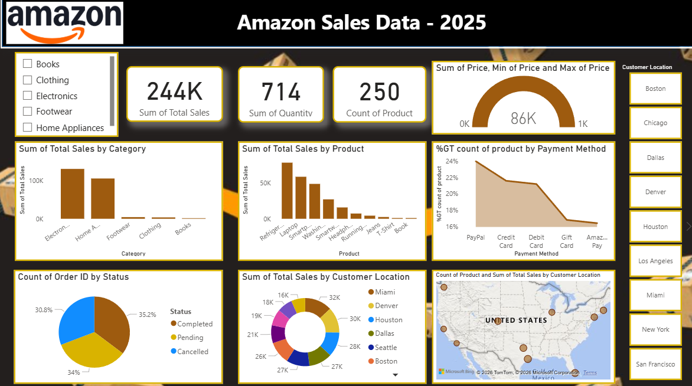
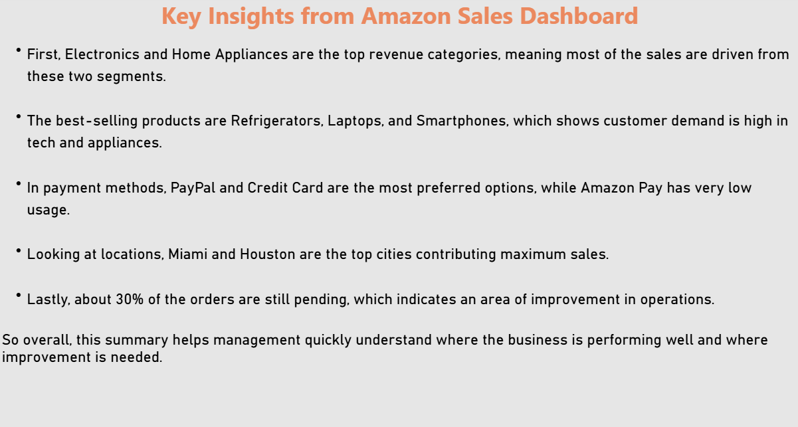

# Amazon Sales Dashboard

## Project Overview
This Power BI dashboard analyzes Amazon sales performance across product categories, customer locations, payment methods, and order status.

## Tools Used
- Power BI
- DAX
- Excel

## Key KPIs
- Total Sales: 244K
- Total Quantity Sold: 714
- Total Products: 250

## Features
- Sales Analysis by Category
- Product Performance Tracking
- Payment Method Insights
- Customer Location Analysis
- Order Status Monitoring
- Interactive Dashboard Design

## Key Insights
- Electronics and Home Appliances generate highest revenue.
- Refrigerators, Laptops, and Smartphones are top-selling products.
- PayPal and Credit Card are preferred payment methods.
- Miami and Houston contribute maximum sales.
- Around 30% orders remain pending.

## Files Included
- Power BI Dashboard (.pbix)
- Dashboard Screenshots
- Key Insights Summary

---

# Dashboard Preview

---

# Key Insights

