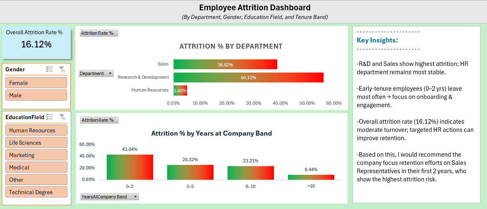
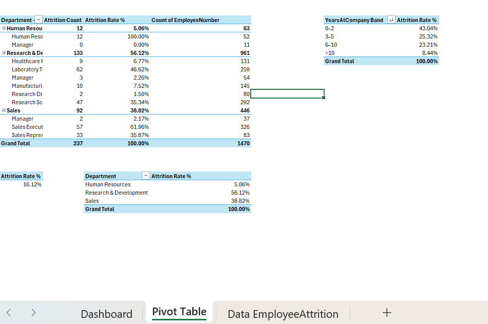

# Employee Attrition Excel Dashboard

## Project Overview
This Excel dashboard analyzes employee attrition trends across departments, tenure bands, gender, and education fields to identify retention risk areas.

## Tools Used
- Microsoft Excel
- Pivot Tables
- Charts & Visualizations

## Key KPIs
- Overall Attrition Rate: 16.12%
- Highest Attrition Department: Research & Development
- Highest Risk Tenure Band: 0–2 Years

## Features
- Department-wise Attrition Analysis
- Tenure Band Analysis
- Gender & Education Filters
- Attrition Risk Identification
- Interactive Dashboard Design
- Pivot Table Analysis

## Key Insights
- Research & Development and Sales show highest attrition.
- Employees with 0–2 years tenure leave most frequently.
- HR department remains the most stable.
- Early retention strategies can improve employee stability.

## Files Included
- Excel Dashboard File (.xlsx)
- Dashboard Screenshots
- Pivot Table Analysis

---

# Dashboard Preview

---

# Pivot Table Analysis

