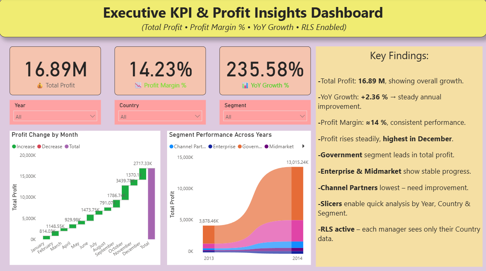

# Executive KPI & Profit Insights Dashboard

## Project Overview
This Power BI dashboard provides executive-level KPI analysis with Profit Insights and Row-Level Security (RLS) implementation.

## Tools Used
- Power BI
- DAX

## Key KPIs
- Total Profit: 16.89M
- Profit Margin: 14.23%
- YoY Growth: 235.58%

## Features
- Executive KPI Monitoring
- Profit Margin Analysis
- Year-over-Year Growth Tracking
- Segment Performance Analysis
- Interactive Slicers
- Row-Level Security (RLS)

## Key Insights
- Government segment generates highest profit.
- Profit performance peaks in December.
- Channel Partners segment needs improvement.
- RLS restricts dashboard access based on user country.

## Files Included
- Power BI Dashboard (.pbix)
- Dashboard Screenshots
- RLS Testing Documentation

---

# Dashboard Preview

---

# RLS Testing & Implementation

