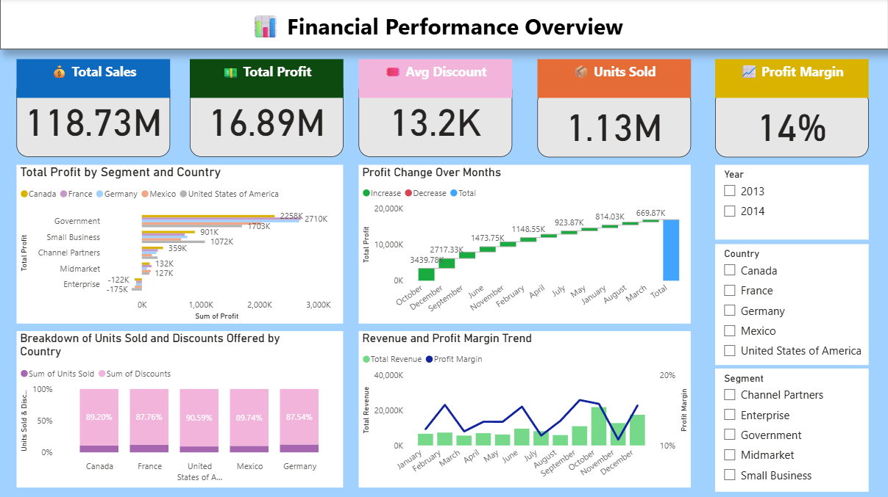
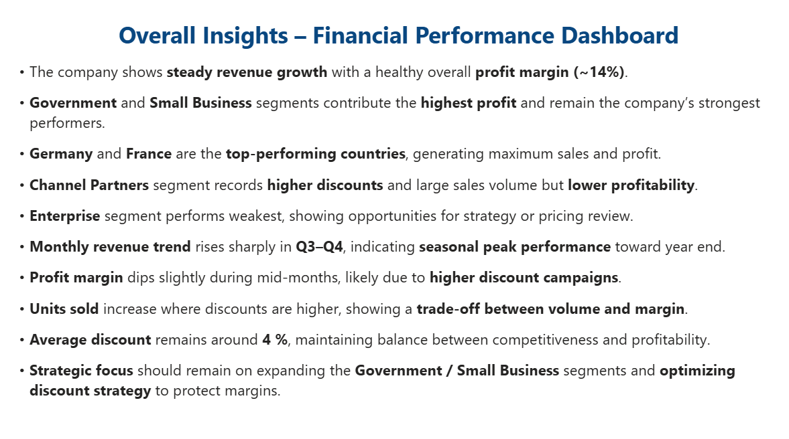

# Financial Performance Dashboard

## Project Overview
This Power BI dashboard analyzes financial performance across countries and business segments.

## Tools Used
- Power BI

## Key Metrics
- Total Sales: 118.73M
- Total Profit: 16.89M
- Units Sold: 1.13M
- Profit Margin: 14%

## Dashboard Insights
- Government and Small Business segments generate highest profit.
- Germany and France are top-performing countries.
- Enterprise segment shows weaker performance.
- Higher discounts increase sales volume but reduce margins.

## Files Included
- Power BI Dashboard (.pbix)
- Dashboard Screenshots
- Insights Summary

## Dashboard Preview

## Insights Preview

