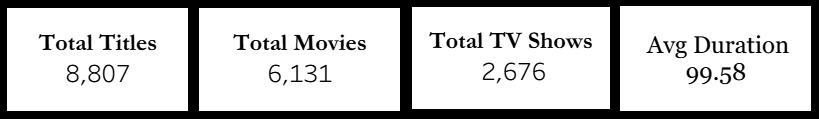
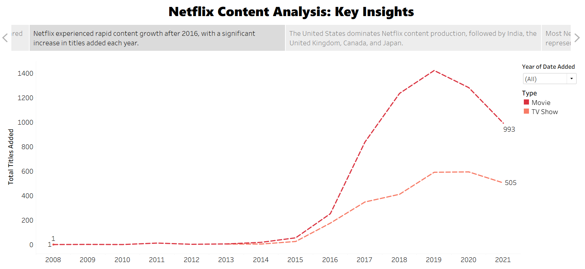
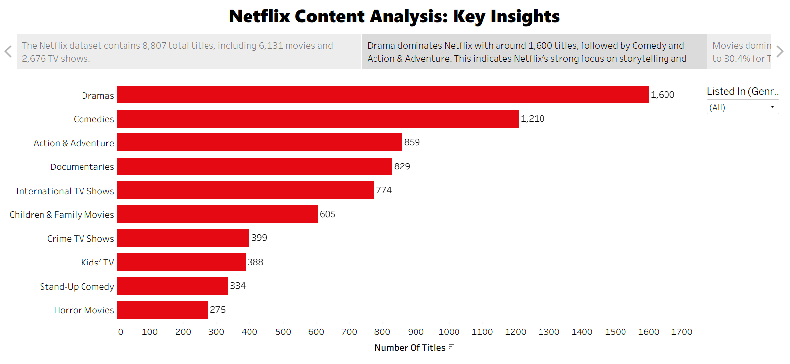

# 🎬 Netflix Content Analysis Dashboard

## 📌 Project Overview
This project analyzes Netflix content using Tableau to uncover trends in content type, genres, duration, and growth over time.

## 🛠️ Tools Used
- Tableau
- Excel / CSV

## 📈 Key Insights
- Netflix has more Movies (69.62%) than TV Shows (30.38%)
- Drama and Comedy are the most popular genres
- Most content duration falls in the medium range (60–120 min)
- The United States produces the highest Netflix content
- Content growth increased rapidly after 2016

## 📸 Dashboard Preview

## 📊 Key Visuals

### KPI Summary

### Content Growth Over Time

### Top Genres on Netflix

## 📊 Dashboard Features
- KPI Cards (Total Titles, Movies, TV Shows, Avg Duration)
- Genre Analysis
- Movies vs TV Shows Comparison
- Duration Distribution
- Content Growth Over Time
- Country-wise Content Analysis
- Interactive Filters (Type, Genre, Year, Country)

## 📁 Files
- Netflix_Content_Analysis_Dashboard.twbx – Tableau dashboard file
- dashboard.png – full dashboard preview
- content_growth.png – growth trend analysis
- top_genres.png – genre distribution
- kpi_summary.png – KPI overview
