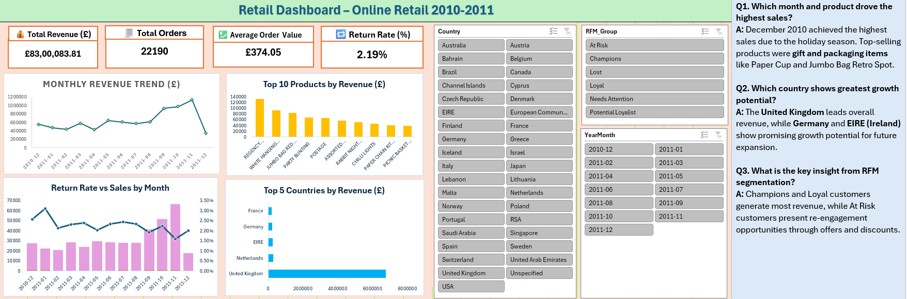
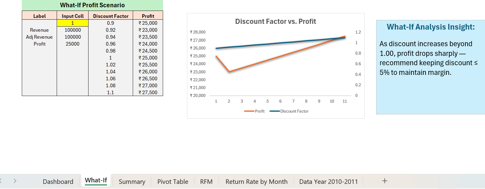
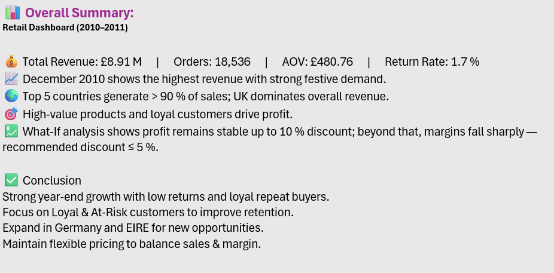
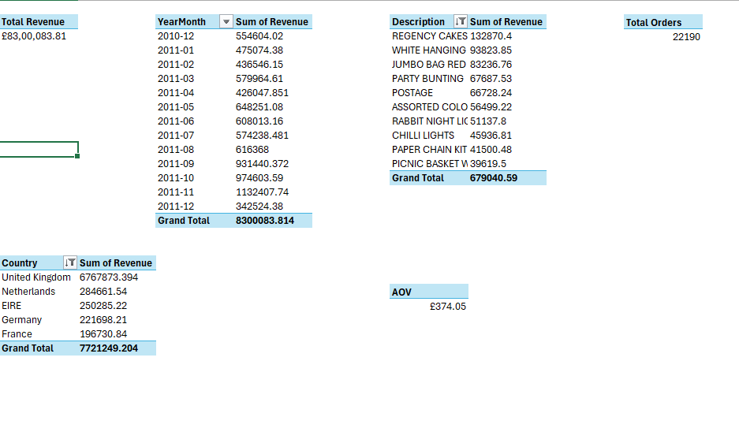
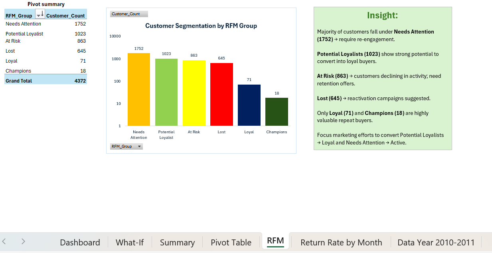
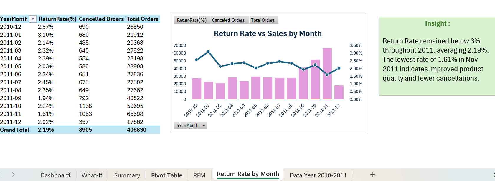

# Retail Analytics Excel Dashboard (2010–2011)

## Download Project File

📥 [Click Here to Download Excel Dashboard](https://1drv.ms/x/c/5e67a7e5bc87a74e/IQDqyztKHHtZRIxEeTgp2hiHARU6xMV5LhOLFJMDmIQj37s?e=vhFbFk)

## Project Overview
This Excel dashboard analyzes online retail sales performance, customer segmentation, return rates, and profitability trends using advanced Excel analytics.

## Tools Used
- Microsoft Excel
- Pivot Tables
- Charts & Visualizations
- What-If Analysis
- RFM Segmentation

## Key KPIs
- Total Revenue: £8.3M
- Total Orders: 22,190
- Average Order Value: £374.05
- Return Rate: 2.19%

## Features
- Monthly Revenue Trend Analysis
- Product Performance Tracking
- Country-wise Revenue Analysis
- RFM Customer Segmentation
- Return Rate Monitoring
- What-If Profit Analysis
- Interactive Dashboard Filters

## Key Insights
- December 2010 achieved the highest sales.
- United Kingdom dominates total revenue.
- Loyal and Champion customers generate highest value.
- Return rates remained below 3% throughout the year.
- Discounts above 5% negatively impact profit margins.

## Files Included
- Dashboard Screenshots
- Summary & Insights
- Pivot Table Analysis
- RFM Segmentation Analysis
- Return Rate Analysis
- What-If Analysis

---

# Dashboard Preview

---

# What-If Analysis

---

# Overall Summary

---

# Pivot Table Analysis

---

# RFM Segmentation Analysis

---

# Return Rate Analysis

