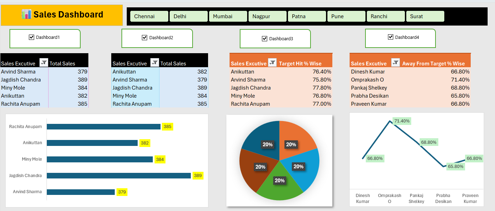
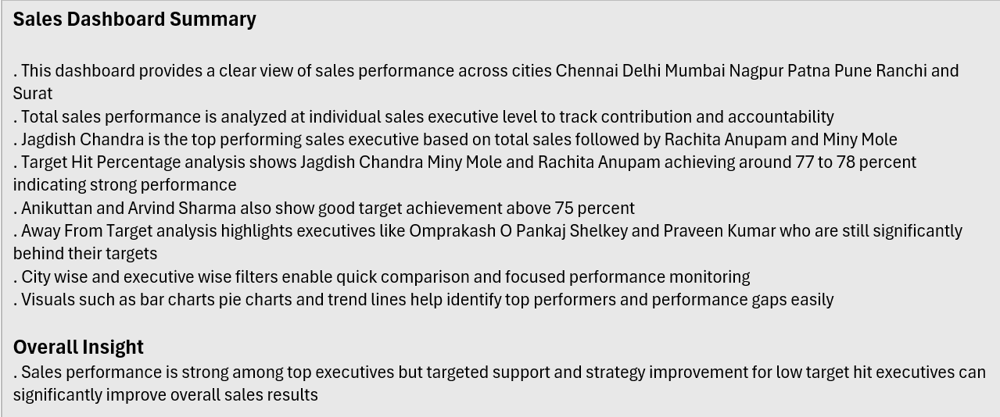

# Sales Excel Dashboard

## Project Overview
This Excel dashboard analyzes sales executive performance across multiple cities with target achievement and sales contribution insights.

## Tools Used
- Microsoft Excel
- Pivot Tables
- Charts & Visualizations
- VBA Macros (.xlsm)

## Key Features
- Executive-wise Sales Analysis
- Target Hit % Tracking
- Away From Target Analysis
- City-wise Filtering
- Interactive Dashboard Controls
- Performance Monitoring

## Key Insights
- Jagdish Chandra is the top-performing sales executive.
- Rachita Anupam and Miny Mole also show strong sales performance.
- Multiple executives achieved more than 75% target hit rate.
- Away-from-target analysis identifies performance gaps clearly.
- City and executive filters enable focused analysis.

## Files Included
- Excel Macro Dashboard (.xlsm)
- Dashboard Screenshots
- Summary & Insights

---

# Dashboard Preview

---

# Dashboard Summary

