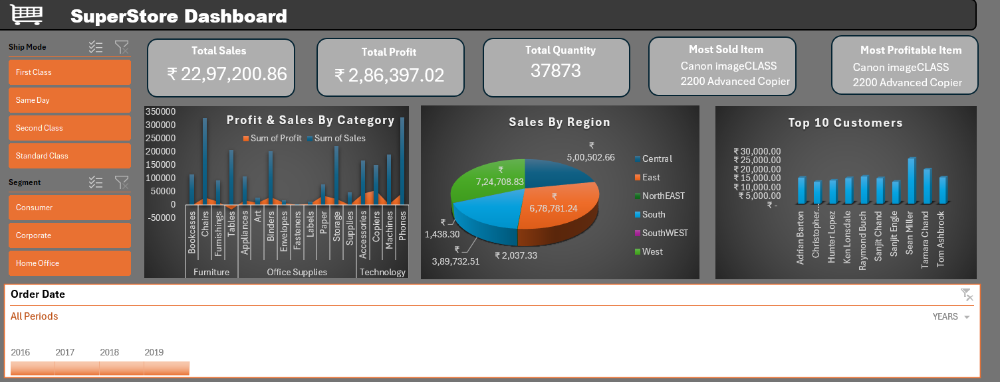
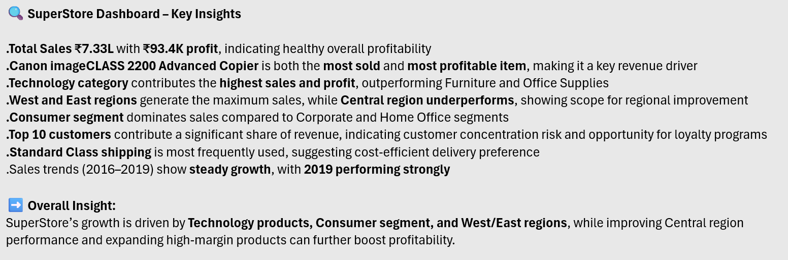

# SuperStore Excel Dashboard

## Project Overview
This Excel dashboard analyzes SuperStore sales performance, profitability, customer trends, shipping modes, and regional sales insights.

## Tools Used
- Microsoft Excel
- Pivot Tables
- Charts & Visualizations

## Key KPIs
- Total Sales: ₹22,97,200.86
- Total Profit: ₹2,86,397.02
- Total Quantity: 37,873

## Features
- Sales & Profit Analysis
- Region-wise Sales Tracking
- Customer Analysis
- Product Performance Insights
- Shipping Mode Analysis
- Interactive Dashboard Filters

## Key Insights
- Technology category contributes highest sales and profit.
- Canon imageCLASS 2200 Advanced Copier is the top-selling product.
- West and East regions generate maximum revenue.
- Consumer segment dominates total sales.
- Standard Class is the most preferred shipping mode.

## Files Included
- Excel Dashboard Screenshots
- Insights Summary
- Pivot Table Analysis

---

# Dashboard Preview

---

# Key Insights

---

# Pivot Table Analysis

