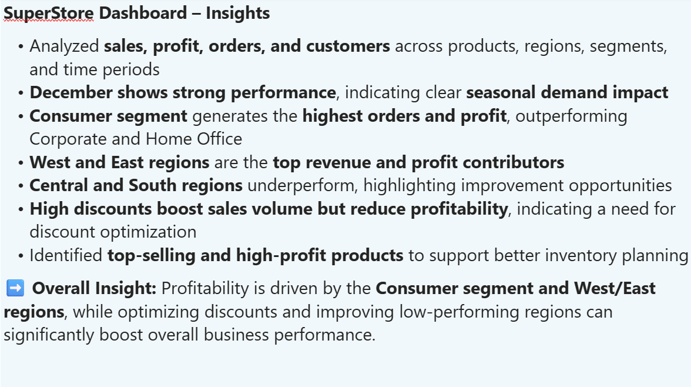

# 🛒 SuperStore Power BI Dashboard

## 📌 Project Overview
This Power BI dashboard analyzes SuperStore sales performance across different regions, products, customers, and segments.  
The dashboard helps identify sales trends, profitability, customer behavior, and regional performance.

---

## 🛠️ Tools & Technologies
- Power BI
- Data Visualization
- DAX
- Data Cleaning
- Business Analysis

---

## 📊 Dashboard Pages

### 1️⃣ Monthly Performance
- Sales and profit analysis by month
- KPI cards for orders, customers, products, and sales
- Zone-wise profit and order analysis

---

### 2️⃣ Region Wise Analysis
- Region and state-wise sales performance
- Profit contribution by region
- Segment distribution across states

---

### 3️⃣ Order Wise Analysis
- Top-selling products
- Customer-wise sales analysis
- Discount impact on products

---

### 4️⃣ Summary & Insights
Key business insights generated from the dashboard:

- Consumer segment generates the highest orders and profit
- West and East regions are top revenue contributors
- High discounts increase sales volume but reduce profitability
- December shows strong seasonal performance
- Identified top-selling and high-profit products

---

## 📈 Key Insights
- Sales and profit are highest in the Consumer segment
- West region contributes the highest profit
- Discounts negatively impact profitability
- Seasonal spikes observed during December

---

## 📂 Files Included
- `SuperStore Dashboard.pbix`
- Dashboard screenshots
- README documentation

---

## 👩‍💻 Author
**Muneeza Ali**  
